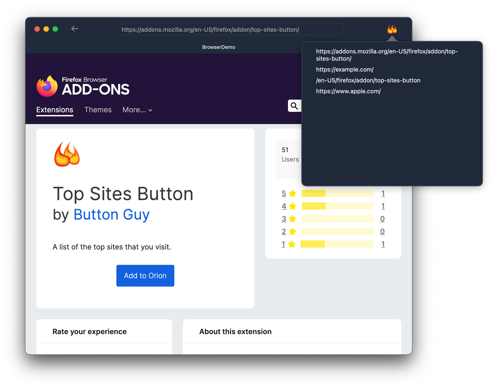

# BrowserDemo

A simple browser demo written in SwiftUI

## Requirements

* macOS 12.0+
* Xcode 13.3+
* Swift 5.6+

## Highlights

* WKWebView wrapper to use in SwiftUI
* Modify [https://addons.mozilla.org/en-US/firefox/addon/top-sites-button/]() page with JavaScript
*  Handle download and unzip of Firefox plugin **xpi** file
*  Parse **xpi** plugin's manifest file and get icon information
*  Show tab bar in main window by default
*  Handle go back function of WKWebView in SwiftUI View
*  Simple top sites manager for test

## Known issues

* WKWebView's navigation function not called properly